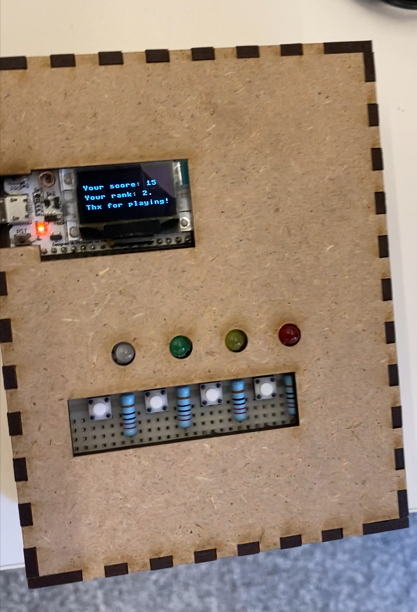

# ESP32-Multiplayer Remote Game

   
  
   

**Creators:** David Benkö, Christina Tüchler, Patrick Trollmann, Renate Zhang \
**Course:** Foundations of Ubiquitous Computing and IoT 2023WS, TU Vienna

## Project Description

The project explores the theme of **remote multiplayer gaming** using technology to foster interaction over a distance. It focuses on creating tangible interfaces and artifacts to enable a seamless and engaging gaming experience for 2 or more players. The project utilized ESP32 microcontrollers and various hardware components to achieve its objectives.

### Features
- Multiplayer functionality over a distance.
- Tangible artifacts to enhance gameplay and communication.
- Integration of IoT and ubiquitous computing principles.

## Technical Details

- **`G1_Project.py`**: Main Python script implementing the game's core functionalities.
- **`G1_WebServer.py`**: Python script managing the web server for remote interaction.
- **`ClosedBox.svg`**: A visual asset used in the project.

### Used Hardware
The project utilized the following hardware components:
- ESP32: Microcontrollers for managing input and communication.
- Motion Sensor: For detecting player interactions.
- Push Buttons and Switches: For tangible artifact inputs.
- LEDs: For visual feedback.
- Wi-Fi Module: Integrated into the ESP32 for remote connectivity.

## License

This project is licensed under the [MIT License](LICENSE).

